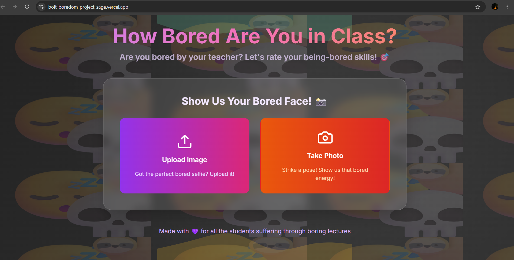

# 😴 How Bored Are You in Class?

An AI-powered web application that analyzes facial expressions from uploaded images or live camera captures to estimate a student's boredom level during lectures.

## 📌 Overview

"How Bored Are You in Class?" is a fun and interactive AI-based web application that allows users to upload a photo or capture a live image using their camera. The system analyzes facial features and expressions to estimate boredom levels and provide an entertaining boredom score.

The project demonstrates the integration of Artificial Intelligence, Computer Vision, and modern web technologies in an engaging real-world scenario.

---

## 🚀 Features

- 📷 Capture photos using webcam
- 🖼️ Upload images from device
- 🤖 AI-powered facial analysis
- 😴 Boredom level estimation
- ⚡ Fast and responsive interface
- 🎨 Modern UI with interactive design
- 📱 Mobile-friendly layout

---

## 🛠️ Tech Stack

### Frontend
- React
- TypeScript
- Vite
- Tailwind CSS

### AI & Computer Vision
- Face API.js

### Development Tools
- ESLint
- npm

---

## 📸 Application Screenshot



---

## 🤖 AI Functionality

The application uses Face API.js to:

- Detect faces in uploaded images
- Analyze facial expressions
- Process visual features
- Estimate boredom-related indicators
- Generate user feedback

---

## 🎯 Objective

To demonstrate the use of computer vision and facial expression analysis in a fun and interactive application while exploring AI-powered user engagement techniques.

---

## ▶️ Run Locally

```bash
npm install
npm run dev
```

Open:

```text
http://localhost:5173
```

---

## 📂 Project Structure

```text
src/
├── components/
├── assets/
├── App.tsx
├── main.tsx
```

---

## My Contribution:
 
• Conducted research on AI-based facial expression analysis techniques.
• Assisted in feature planning, testing, and project documentation.
• Supported the development team by evaluating suitable technologies and implementation approaches.

---
